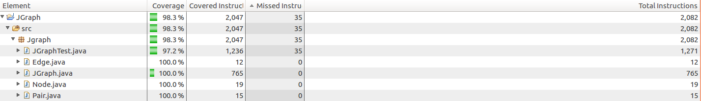

# JGraph
##A directed graph implementation in Java

###Getting Started
JGraph is a mutable Abstract Data Type (ADT). JGraph was created to practice creating ADTs as well as avoiding representation exposure. It currently abstracts graphs in adjacency list format, but in the future an adjacency matrix representation will be added to increase efficiency of certain algorithms. To learn more about ADTs click [HERE](https://en.wikipedia.org/wiki/Abstract_data_type) and to learn more about representation invariants and abstraction functions click [HERE](https://courses.cs.washington.edu/courses/cse331/11wi/lectures/lect05-af-ri.pdf).

JGraph is a graph implementation that allows users to solve graph problems by adding nodes and edges to the class then solving the problems using JGraph's built in methods. JGraph supports custom data types as it is built with generics. It supports path finding with Dijkstra's algorithm. Full [documentation](https://github.com/MatthewMawby/Jgraph/wiki/Documentation) for JGraph is specified in the [wiki](https://github.com/MatthewMawby/Jgraph/wiki/home) in a javadoc-like format.

JGraph has been well tested and 100% coverage has been achieved for JGraph and its related classes.

If you have any questions, comments, contributions, or concerns feel free to make an issue, submit a pull request, or send me a message!

Thanks!
